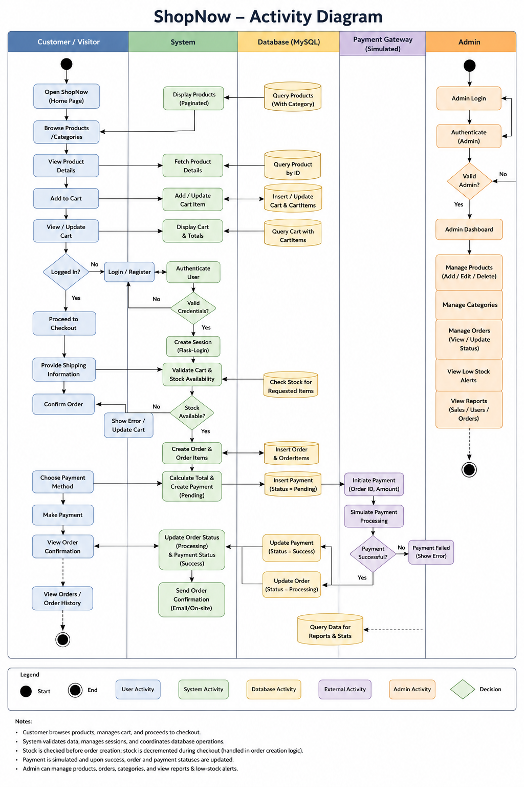

# Software Requirements Specification (SRS) for ShopNow

## Preface

This document provides the Software Requirements Specification (SRS) for ShopNow. It defines the system’s functionalities, tech stack parameters, security requirements, and overall structural expectations necessary for engineering and deployment.

----------

## Version History

-   **Version 1.0** – Initial Draft based on core repository architecture.
    
-   **Version 1.1** – Added detailed project directory structures, endpoint mappings, and operational requirements.
    

----------

## 1. Introduction

### Purpose

The ShopNow application is a server-rendered web platform designed to streamline retail operations. It provides customers with intuitive product browsing, dynamic cart persistence, and secure checkout simulation while provisioning administrators with inventory management dashboards and sales metrics.

### Document Conventions

This document follows standard engineering practices, utilizing:

-   **Must** – Indicates strict structural constraints or mandatory features.
    
-   **Should** – Indicates highly recommended workflows or optimal configurations.
    
-   **May** – Indicates optional features or simulated workflows.
    

### Intended Audience and Reading Suggestions

-   **Backend Engineers** – To reference core app factories, Blueprints, and database relations.
    
-   **Database Administrators** – To validate SQLAlchemy ORM structures against MySQL constraints.
    
-   **QA & Testers** – To benchmark functionality using PyTest routines and authentication validations.
    

### Scope

The platform covers:

-   Session-based role authentication (Admin vs. Customer).
    
-   Paginated product catalogs with automated inventory management.
    
-   Persistent cart mechanics matching real-time database stock counts.
    
-   Simulated gateway payments and automated post-purchase workflows.
    
-   Administrative analytics dashboards and low-stock indicators.
    

### References

-   Flask Documentation (App Factory Pattern)
    
-   SQLAlchemy Object-Relational Mapping (ORM) Manual
    
-   IEEE Standard 830-1998 (Software Requirements Specification template models)
    

----------

## 2. Overall Description

### Product Perspective

ShopNow runs as a standalone server-rendered Python web app using Flask. It relies on a singular MySQL relational database back-end and exposes native endpoints alongside a minor JSON ingestion API for swift catalog expansion.

### Product Functions

-   **User Session Control:** Client registration, secure login caching, and profile alterations.
    
-   **Catalog Control:** Modular data display matching product availability with integrated picture loading.
    
-   **Transactional Loop:** Stateful persistent carts tracking quantity caps, converting to orders upon valid checkout flags.
    
-   **Admin Controls:** Dynamic sales charts, system volume tallies, operational states monitoring, and catalog manipulation tools.
    

### User Classes and Characteristics

-   **Customer:** Browses store, updates local carts, places orders, checks order logs.
    
-   **Admin:** Inherits global access. Updates item metrics, monitors low stock warning alerts, controls order logistics status.
    

### Operating Environment

-   **Platform compatibility:** Linux, macOS, Windows (built-in PowerShell initialization setups).
    
-   **Database Architecture:** MySQL 8.x / XAMPP compatibility layers via PyMySQL.
    
-   **Python Runtime:** Python 3.8 to 3.11+.
    

### Design and Implementation Constraints

-   Data layers **must** utilize SQLAlchemy wrappers exclusively.
    
-   Input components **must** leverage WTForms to enforce secure server-side form validations.
    
-   File handling routines **must** restrict execution privileges inside asset directories (`app/static/uploads`).
    

### Assumptions and Dependencies

-   Local application state depends heavily on correct configurations inside a root `.env` document file.
    
-   Application sessions rely on client browser cookies supporting stateful storage mechanisms.
    

----------

## 3. System Requirements Specification

### Functional Requirements

#### User Authentication

-   The system **must** allow new users to register secure accounts and enforce distinct customer vs. admin roles.
    
-   Unauthorized traffic **must** be isolated from critical execution screens (Cart modification, Checkout gates, Admin views).
    

#### Product Catalog & Search

-   The catalog system **must** chunk database queries into fixed paginated frames (12 items per screen).
    
-   The backend **must** automatically establish new product categories dynamically if a batch creation request mentions a category that doesn’t exist yet.
    

#### Cart & Transactional Mechanics

-   Carts **must** remain persistent across system logouts by binding records to registered user primary keys.
    
-   Inventory thresholds **must** be verified before items can be added to a cart or before an order is placed.
    
-   On order submittal, the database **must** safely decrement global product count metrics.
    

#### Reporting & Administration

-   The administrative control dashboard **must** dynamically report overall sales profits, registered client counts, and order volumes.
    
-   The backend system **must** automatically flag items whose volume metrics drop beneath set thresholds.
    

----------

### Non-Functional Requirements

#### Performance Requirements

-   Server rendering operations should process in under 200ms under standard database indexing conditions.
    
-   The payload validation layer **must** hard-stop media updates exceeding 5MB to preserve operational network pipelines.
    

#### Security Requirements

-   Every mutation request (POST/PUT) **must** pass strict CSRF validation checks via Flask-WTF.
    
-   Application administrative access tokens **must** read straight from cryptographically hashed values, isolating production secrets away from plain text databases.
    

#### Reliability & Availability

-   The application should boot inside an isolated environment wrapper, ensuring identical operations regardless of development host system variants.
    

----------

## 4. System Models

### Architecture & Folder Layout Model

Below is the directory structural framework enforcing architectural separations across business units:

```
ShopNow/
├── app/
│   ├── __init__.py          # Main application initialization (Factory)
│   ├── extensions.py        # Extensions bindings (DB, Migrate, Login, CSRF)
│   ├── models.py            # Relational Entities (User, Catalog, Orders, Payments)
│   ├── blueprints/          # Modular routing containers (Auth, Main, Admin, etc.)
│   ├── forms/               # Input safety validation layers (WTForms)
│   └── templates/           # Server-rendered templates (Jinja2)

```

----------

### System Process Models

> -   **SYSTEM CONTEXT DIAGRAM**
Shows the boundaries between users (Customers, Admins), the Flask application engine, and the MySQL storage layer.
   
   

----------

> - **Entity-Relationship Diagram (ERD)**

The database schema maps out how entities connect to handle user sessions, dynamic carts, order processing, and payment simulations.

   
   
----------

## 5. System Evolution

### Assumptions

-   As request volumes scale, the monolithic file upload architecture should pivot toward an S3 object storage model.
    
-   The payment processing loop can easily replace its simulated state engine with production-ready Stripe API endpoints.
    

### Expected Changes

-   Migrating from basic cookie storage setups to Redis cache stores to enhance user session performance.
    
-   Moving from manual SQL schema updates to full, systematic Flask-Migrate script tracking.
    

----------

## 6. Appendices

### Hardware Requirements

-   **Minimum Host Setup:** 1 Virtual CPU core, 1GB System memory RAM, 5GB persistent storage space.
    

### Database Requirements

-   MySQL databases must support configurations utilizing the `utf8mb4_unicode_ci` collation set to maintain clean, error-free text sorting.
